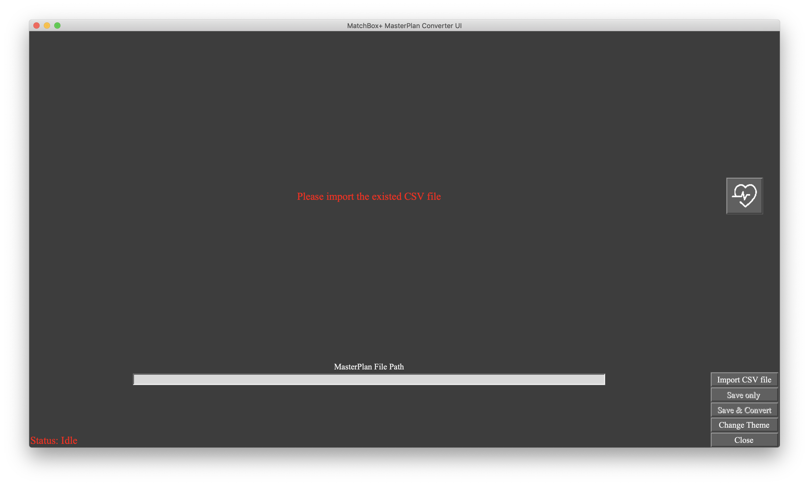
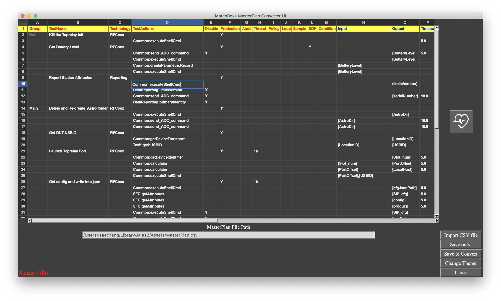
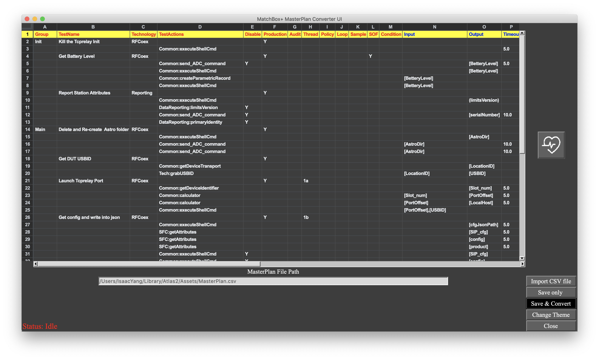

# MatchBox+ Master Plan Converter 

## Overview
**Version: 1.0.2_Beta**
This is an UI app,  it support edit/save csv file, and it also can convert **`Masterplan.csv`** to **`Init.csv`**, **`Main.csv`**, **`Teardown.csv`**, **`[$Tech].csv`**.

## Install
* This app is already included `.py` and `libs`, so you don't need to install any python env or libraries.

* Download the pkg file from [rdar://82782596](rdar://82782596), and install it. 
> If any release, I will upload to this radar.

* **MatchBox+ MasterPlan Converter UI.app**  will be under `/Applications/`.
* There is an template located in  `/Users/Shared/MatchBox+ MasterPlan template/`. Then you can copy the `/Assets/` folder to any path you want.
``` ad-warning
collapse: open
Due to someone's mac don't have the access to edit the file under `/Users/Share/`, please must to copy the templete to other path.
If you don't have the access of that path, the app will not be able to save the file.
```


## How to use the app
* Open the app, of course.
* Use the **Import CSV file** button to select the csv file you want to view or edit.
* If you want to edit the csv file, you can use this app like excel/number.
* After editing, you only need to click the **Save only** or **Save&Convert** button.
   
   
   
   
``` ad-note
collapse: open

If you import not **`MasterPlan.csv`** file, the **Save&Convert** button will be disabel.

**Save only Button: ** it only save/overwrite the original csv file.
**Save&Convert: ** it will save/overwrite the **`MasterPlan.csv`** and convert the **`Masterplan.csv`** to `**Init.csv`**, **`Main.csv`**, **`Teardown.csv`**, **`[$Tech].csv`**(under **`/Tech/`** folder)
```
* If you want to close the app you have the two way to left.
	 1.  Using the **Close**button.(Bottom right corner) 
	 2.  Using the **x** button the app original way. (Upper left corner) 

## Others
* There is two (light/dark) theme in this app. Depend on which theme you like, you can click the **Change Theme** button to switch it, and the default is dark.   


----
----
**By the way:**
There is a document of **Atlas2-MatchBox** which Jean optimize the structure (the following will call **MatchBox+**) contained in this pkg.
The **MatchBox+Doc** is under `/Users/Shared/`, and this is only the template.
You also can check it, but there is only few things in that document.
``` ad-note
title: MatchBox+DOC entry
collapse: open

It is the `.html`, and you only need to double click the `MatchBox+.html`.

```


## Version History
* V1.0.0 : 
	1. This is the beta version.
* V1.0.1: 
	1. Fix missing test action bug, during converting to **`Init.csv`**, **`Main.csv`**, **`Teardown.csv`**
	2. Add the Status at the bottom left corner of this app
		* **`Idle`**, **`Saving`**, **`Converting`**,** `done`**
* V1.0.2_Beta: 
	1. Fix the right clicking the row to choose the Insert row below bug. (Upgrade the **`tksheet`** from 5.0.30 to 5.0.32)
	2. FIx the duplicate `TestName`(all test actions) in **`[$Tech].csv`** bug. 
	    When you use the same `TestName` in the same **`[$Tech].csv`**, it will only show once and will be the first  `TestName`'s actions' in **`MasterPlan.csv`**.
	3. Support different **`MasterPlan.csv`** to convert to the same **`Init.csv`**,  **`Teardown.csv`**, but different **`Main.csv`** (ie **`$Prefix-Main.csv`**, this `$Prefix-` is grab from the **`MasterPlan.csv`** file's prefix.) 
	    And the **`[$Tech].csv`** will be updated not overwrite any more.
	4. Make the UI smoother when changing the theme.